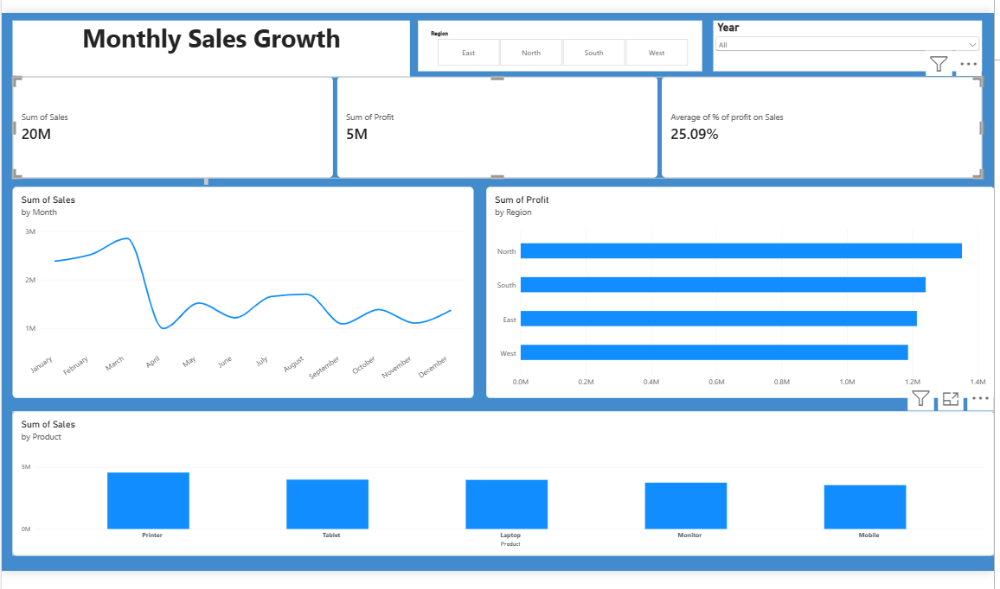

 Sales Analytics Dashboard

 📌 Project Overview

This project is an end-to-end Sales Analytics project that transforms raw sales data into meaningful business insights.

The project follows the workflow:

**Raw Data → Python → SQL → Power BI**

I used Python to clean and transform the raw sales data, stored the cleaned data in SQL, and connected Power BI to the SQL database to create an interactive dashboard.

 🛠️ Tools & Technologies

- Python
- SQL
- Power BI
- Excel
- Pandas

 🔄 Project Workflow

 1. Data Cleaning – Python

- Loaded the raw sales data using Python.
- Cleaned and transformed the dataset.
- Handled data quality issues.
- Prepared the cleaned data for analysis.

 2. Data Storage & Analysis – SQL

- Uploaded the cleaned dataset into SQL.
- Used SQL queries to analyze the sales data.

 3. Dashboard Development – Power BI

- Connected Power BI to the SQL database.
- Created an interactive sales dashboard.
- Used KPIs, charts and filters to present the results.
- Analyzed sales and profit across months, regions and products.

 📊 Dashboard

The dashboard provides insights into:

- Monthly sales performance
- Profit by region
- Sales by product
- Overall sales
- Overall profit
- Profit percentage on sales
- Year and region-wise filtering

🖼️ Dashboard Preview

## 📁 Project Files

| File | Description |
|---|---|
| `sales_data_cleaning.ipynb` | Python notebook used for data cleaning and transformation |
| `sales_analysis.sql` | SQL queries used for data analysis |
| `Sales_dashboard.pbix` | Power BI dashboard file |
| `Sales_dashboard.png` | Dashboard preview image |

## 🎯 Key Learning

Through this project, I gained practical experience in data cleaning, SQL analysis, data visualization and building an end-to-end data analytics workflow.
